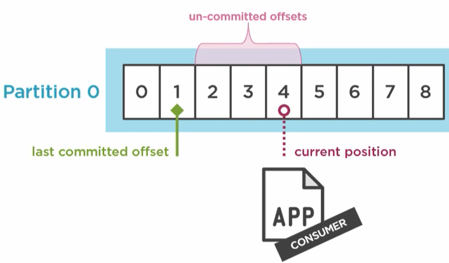

# Kafka (distributed, sequential commit log system)

Kafka is actually a highly distributed raw commit logs, that brokers read/write using pub/sub semantics.

Some stats on Kafka ability:

- LinkedIn = 1400 brokers, 2 PB/week
- NETFLIX = 4000 brokers, 36 clusters 700B messages/day

### Pros

- large scale data movement pipelines, Great pairing with big data systems like hadoop, spark
- Consumers are autonomous and horizontally scale. Slow or failed consumers don’t impact other consumers.

### Cons

- Message Routing, message transformation is efficient.
  - Kafka stream can be used for filtering, transofrmation etc. however it means, message duplication and addtional purpose built topics.
- Message can't have different priority, policy, security etc. GDPR is a challenge
- Data governance is a challenge because ineviably multiple payload version get added by several producers. There is no std data governance model. (use Kafka schema registry, or Need third party tools for schema versions mangement).

## High level Architecture

- It is pub/sub or producer/consumer system
- receive message -> categories in topic -> reliably persist
- Why fast?

[](https://www.youtube.com/watch?v=UNUz1-msbOM)

- what is kafka connect?
- <ins>kafka stream</ins> - for filtering, transoforming, agreegation etc.
- <ins>KSQL</ins> - a kafka client that follows SQL schema.

## Broker Cluster

Broker is daemon service responsible for

- Storage and config updates (zookeeper) and communication
- No centralized load balancer/single access point. No single point of failure.
- **Broker Coordination strategy**: Consensus or Gossip protocol
  - Elect Leader node. Leader responsibility is
    - Attendance & health (of brokers)
    - work assignment based on risk policy e.g. redundancy.
    - keeping work status. (Work is completed using Quorum)
  - Broker joins the cluster and keeps a copy of cluster state.

Note: Many features mentioned (e.g. name lookup, comfig change, leader election, health check etc.) are actually in zookeeper which will soon move to Kafka.

## Topic

Logical entity that spans across multiple brokers across cluster. Topic is generally split in partitions to support concurrency.

Design question: How to choose topic? Is every action separate topic? What size is good?

Message Retention Policy - defined per topic, default (7 days)

### Commit Logs

- Source of truth.
- Point of recovery
- Basis for replication and distribution. Redundancy, fault tolerance

## Partitions == log == max consumers within consume group

- Seq is guaranteed only within partition.
- Topic has default or provided **partitioning scheme** to balance partitions
- Partition owner or leader is elected to manage partition. One broker will manage one of more partitions. (This metadata information is replicated to all brokers). Partition leader
  - sets up and monitor quorum & ensures replication. i.e. ISR(in-sync-replica) == replication-factor
  - facilitates message actions on that partition
- A producer should know at least one broker to fetch metadata (and hence know the partition leads) of topic to send messges.
- Consumers should know at least one broker to fetch metadata (and hence partition leads, partition offsets).
- Two consumers within a consumer group cannot read from same partition to guarantee seq.
- Partitioning tradeoffs - lots of partitions bring parallelism but too many partitions makes fail-over complicated

Note: frequent ISR shrinks for a partition means that the data rate for that partition exceeds the leader’s ability to service the consumer and replica threads.

### Add new partitions to topic

It is possible but there is a pitfall,

- Be aware that one use case for partitions is to semantically partition data, and **adding partitions doesn't change the partitioning of existing data** so this may disturb consumers if they rely on that partition. That is if data is partitioned by **hash(key) % number_of_partitions** then this partitioning will potentially be shuffled by adding partitions but Kafka will not attempt to automatically redistribute data in any way.
  (Only option in this case would be to stop consumption on current topic, and create a new topic with required partitions.)

## Producer

Sequence Flow: Get cluster metadata using bootstrap brokers (& keep up-to-date) -> serialize -> identify partition (using partition strategy) -> send to partition leader (in micro batch) -> acknowledge or retry -> loop -> disconnect

<ins>Producer uses partition strategy to identify partition and talks to the partition leader directly.</ins>

```properties
request.required.acks = 0: fire & forget, 1: leader acknowledged, 2: quorum acknowledged
retries = Integer.MAX_VALUE (if data loss in not tolerable)
max.in.flight.req.per.conn (1 -> guarantees absolute order) because in flight req are processed in parallel

//for throughput tuning buffer.memory, batch.size. Do think of jvm gc though
//max.block.ms/linger.ms - how much to wait for batch

```

Note: Track metrics to actually know message injection pattern, size etc.

## Consumer/Consumer group

Sequence Flow: Get cluster metadata using bootstrap brokers (& keep up-to-date) -> get partition assignments and offsets -> provide topic list and receive message batch -> process message & keep sending heartbeat -> commit offset -> loop -> disconnect

**Kafka consumers are single threaded, one poll loop per consumer**

```properties
receive.buffer.bytes //socket buffer, default is too low. -1 means OS decides the buffer size

heaartbeat.interval.ms //consumer to send heartbeat
session.timeout.ms //amount of time consumer group coordinator (a broker) will wait before consumer rebalance
```

Consume what can be processed efficiently. Consume fixed size buffers. (Prioritize not getting dropped out of consumer group).

### Offset (Bookmark) behavior:

Last committed offset - consumer's confirmed read.
Current Read position - consumer reading
Uncommitted offset - gap between these two. App design tries to make it narrow. (But guaranteed axn hence eventual consistent)


Note: Kafka stores committed offsets in a special topic **\_\_consumer_offsets**. A consumer produces the committed offsets this topic. This topic is used for next consumer to fetch last commit offset.

```properties
// check the status use this.
topic describe __consumer_offsets
```

```properties
// automatic mode
// Kafka automatically commits after auto.commit.interval, system is not eventual consistent because no error recovery for unprocessed but committed message
enable.auto.commit = true
auto.offset.reset  //check this one too

// manual mode - for consistency control.
// Exactly once delivery will need another transactional db.
// consumer needs to update __consumer_offsets using commitSync and commitAsnc methods
enable.auto.commit = false

```
